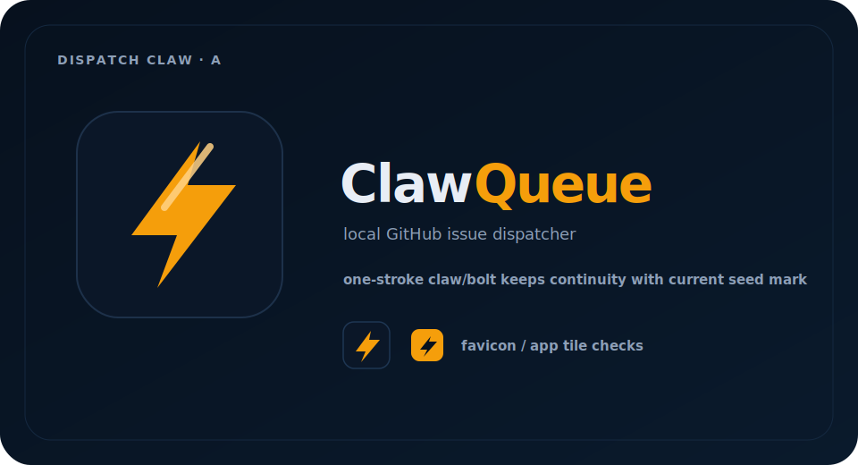
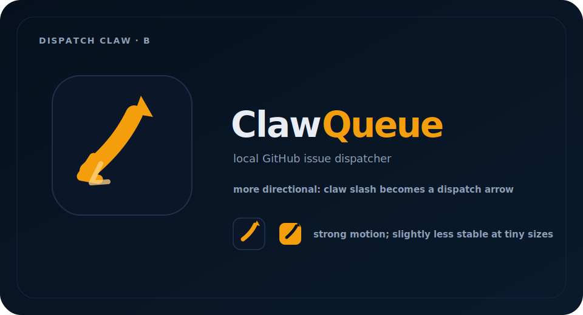
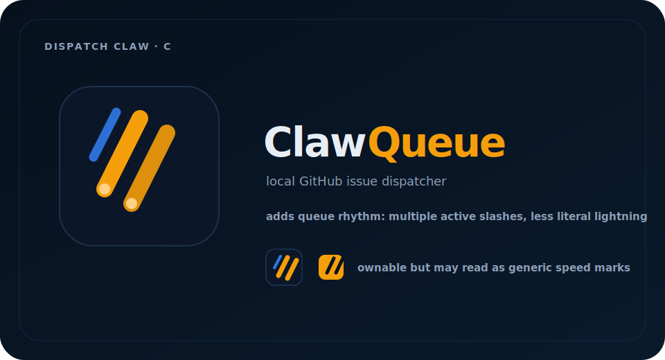
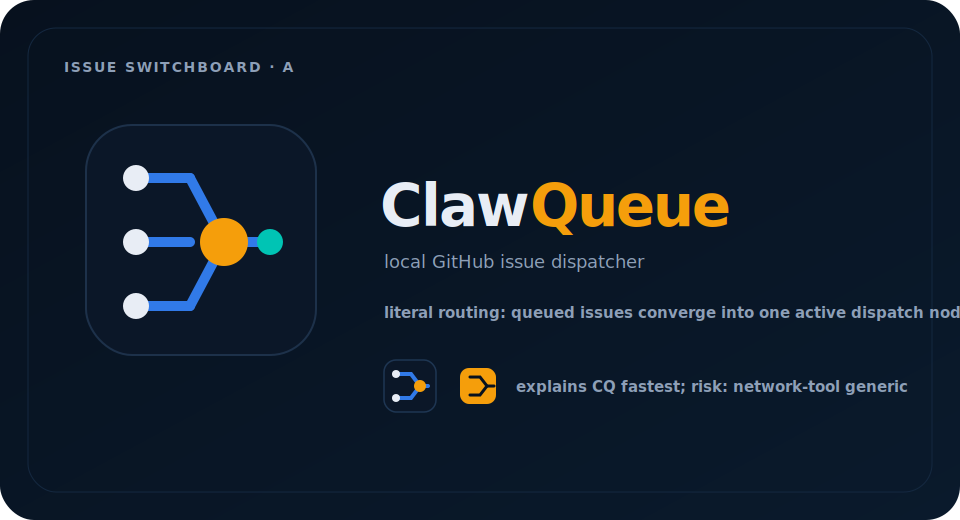
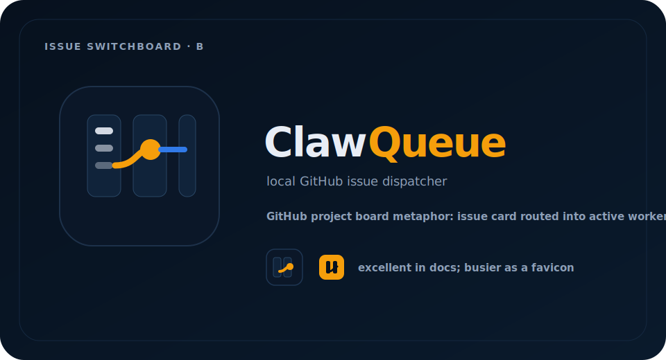
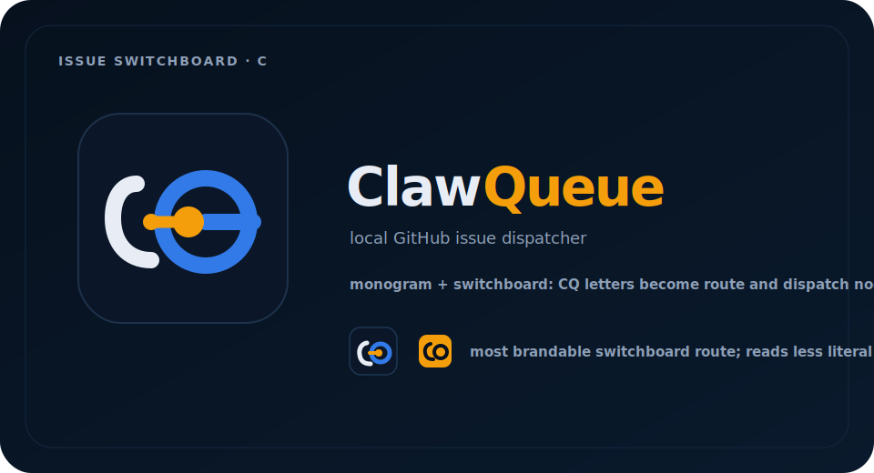
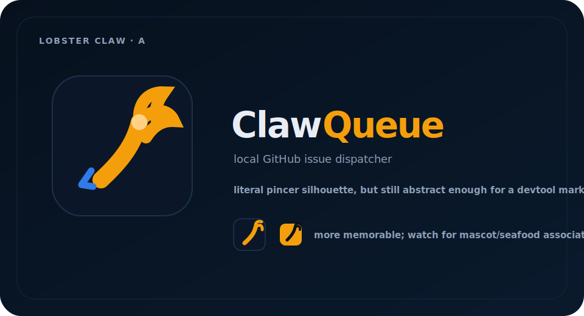
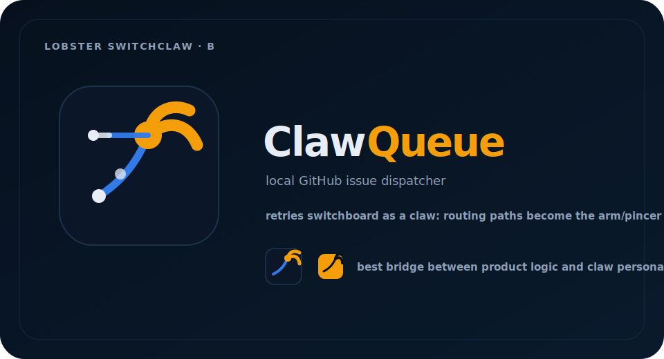
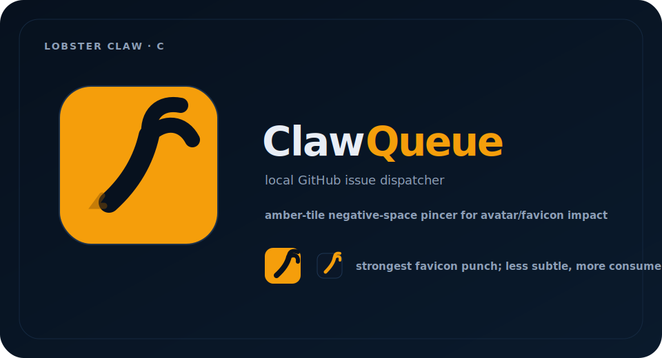
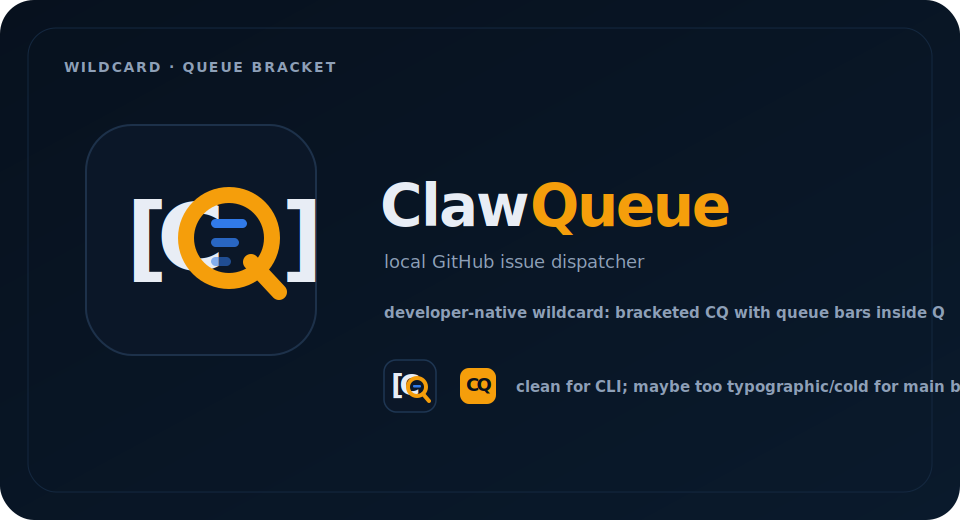

# ClawQueue draft logo variants

**Issue:** ClawQueue/ClawQueue#2  
**Date:** 2026-05-10  
**Status:** Internal exploratory logo drafts, not final/public brand lock-in.  
**Source brief:** [Issue #1 logo direction exploration](../0001-clawqueue-logo-directions.md)

## Goal

Turn the strongest Issue #1 logo directions into concrete draft image assets that are easy to compare: **Dispatch Claw**, **Issue Switchboard**, plus one wildcard from **Queue Bracket**. This revision also responds to the retry note asking for **lobster claw** variations and another pass where the switchboard idea behaves more like a claw.

## Shared visual system

All drafts use the current ClawQueue visual cues from the README/design-system surface:

- deep navy: `#07111E`
- system blue: `#317AE8`
- active/claw amber: `#F59E0B`
- light foreground: `#E8EDF5`
- dark-mode operator tooling, mono labels, compact GitHub/avatar/favicon checks

The SVGs are intentionally rough, geometry-first concept drafts. They are meant to test direction, not polish.

---

## Recommendation

### Keep for next round

1. **Lobster Switchclaw B — Routing Pincer**  
   Best response to the retry note: it makes the switchboard/routing idea feel like a claw instead of a generic network diagram. It keeps product meaning while adding a more memorable ClawQueue personality.

2. **Dispatch Claw A — Seed Bolt**  
   Best continuity with the current seed identity. It is simple, memorable, and likely to survive favicon/app-icon constraints.

### Also worth a quick second look

- **Lobster Claw C — Negative Space Pincer** if the priority is a high-impact GitHub/avatar/favicon mark.
- **Issue Switchboard C — CQ Circuit** if the team wants the brand to stay more abstract/product-explanatory and less lobster-like.

### Likely weaker

- **Issue Switchboard B — Board Route** explains the product well at large size but is probably too detailed for a favicon.
- **Wildcard Queue Bracket** is clean for CLI/docs contexts, but may be too cold and typographic as the primary identity.
- **Lobster Claw A — Pincer Dispatch** is memorable, but may push too far toward literal lobster/mascot territory unless simplified.

---

## Dispatch Claw variants

### Dispatch Claw A — Seed Bolt

**What changed:** Refines the existing amber lightning/claw seed into a heavier, more app-icon-ready stroke inside a navy rounded tile.

**Works well / breaks down:** Strongest tiny-mark candidate and best continuity with the current README/design system. Risk: if left too lightning-like, it can feel generic or over-index on speed rather than durable workflow.

### Dispatch Claw B — Arrow Hook

**What changed:** Pushes the claw stroke toward a dispatch arrow with a hooked tail, making the “send work to an agent” motion more explicit.

**Works well / breaks down:** Good for motion/dispatch language and UI activity states. At very small sizes the hook/arrow geometry may lose clarity faster than A.

### Dispatch Claw C — Queue Slashes

**What changed:** Splits the claw idea into multiple active slashes, adding queue rhythm and making the mark less like a single lightning bolt.

**Works well / breaks down:** More ownable than a plain bolt and feels agent-active. Risk: could read as generic speed marks or “performance tooling” rather than issue dispatch.

---

## Issue Switchboard variants

### Issue Switchboard A — Hub Node

**What changed:** Uses a simple routing diagram: queued issue inputs converge into one amber dispatch node and exit toward a runner/output.

**Works well / breaks down:** Explains CQ quickly and supports docs/architecture pages. Risk: can feel like generic network/infrastructure software unless paired with a strong wordmark.

### Issue Switchboard B — Board Route

**What changed:** Makes the GitHub Project board metaphor visible: a queued issue card routes from a column into an active worker lane.

**Works well / breaks down:** Best at explaining “GitHub Issues/Projects as control plane.” Too detailed for favicon use; better as onboarding/header illustration than primary logo.

### Issue Switchboard C — CQ Circuit

**What changed:** Compresses switchboard logic into a CQ-like monogram: the `C` becomes an incoming route, the `Q` becomes the dispatch loop, and amber marks the active handoff.

**Works well / breaks down:** Most brandable switchboard route and stronger at small sizes than A/B. Slightly less literal, so it may need wordmark/context early on.

---

## Lobster claw retry variants

These variants respond directly to the retry comment: “try some variations based on lobster claw. The switchboard idea looks a bit like a claw, give it another try.” The goal is to borrow lobster-claw geometry without becoming a mascot, seafood brand, or glossy character.

### Lobster Claw A — Pincer Dispatch

**What changed:** Turns the earlier Dispatch Claw stroke into a more explicit lobster pincer: one arm, two claw tips, and a subtle blue tail/handoff cue.

**Works well / breaks down:** More memorable and more name-linked than the seed bolt. Risk: if refined too literally, it could feel mascot-like or drift away from sober operator tooling.

### Lobster Switchclaw B — Routing Pincer

**What changed:** Reworks the Issue Switchboard idea so the routing paths become the claw arm and pincer. The amber hub remains the active dispatch node; blue paths keep the system/routing cue.

**Works well / breaks down:** Strongest bridge between “switchboard” product meaning and “claw” brand memory. It should be tested heavily at favicon size because it has more moving parts than the seed bolt.

### Lobster Claw C — Negative Space Pincer

**What changed:** Uses an amber app tile with a navy negative-space pincer. This flips the mark for stronger avatar/favicon impact.

**Works well / breaks down:** Highest small-icon punch and easiest to recognize as a claw. It is less subtle and may feel more consumer/mascot-adjacent than the darker operator-tool marks.

---

## Wildcard variant

### Wildcard — Queue Bracket

**What changed:** Uses the weaker/alternate Queue Bracket concept as a typographic developer mark: `[C Q]`, with queue bars embedded inside the Q.

**Works well / breaks down:** Good for CLI/docs badges, monochrome use, and developer-native surfaces. It may be too cold and too `CQ`-dependent to carry the main product identity alone.

---

## Next-round refinement brief

If moving forward with **Lobster Switchclaw B**, simplify the pincer/routing geometry until it reads at 16px: keep the amber dispatch hub, one blue incoming path, and two amber pincer tips. Avoid adding eyes, legs, shell details, or any mascot cues.

If moving forward with **Dispatch Claw A**, refine the amber stroke so it is unmistakably custom: less generic lightning, more “claw slash + dispatch angle + terminal energy.” Test as:

- 16px favicon
- 40px GitHub/avatar mark
- README horizontal wordmark
- monochrome icon
- SVG on deep navy and on amber backgrounds

If moving forward with **Issue Switchboard C**, simplify the monogram even further and test whether the CQ/routing idea remains legible without explanatory copy.

## Human approval note

These are internal draft image assets for comparison only. Before public use, run human review, small-size legibility checks, basic similarity checks against neighboring devtool logos, and a proper SVG cleanup pass.
