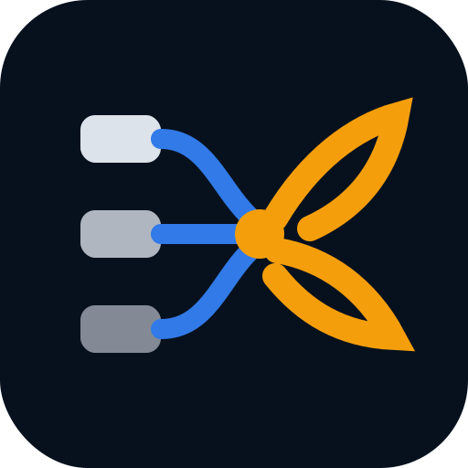

# ClawQueue draft logo variants

**Issue:** ClawQueue/ClawQueue#2  
**Date:** 2026-05-17  
**Status:** Retry-pass internal exploratory logo drafts. Not final/public brand lock-in.  
**Source brief:** [Issue #1 logo direction exploration](../0001-clawqueue-logo-directions.md)

## Goal

Turn the Issue #1 logo directions into actual draft image assets for comparison. This retry pass responds to the non-CQ feedback asking for more lobster-claw variation and another try at making the switchboard idea feel like a claw, while also using the latest Issue #1 recommendation to include a Queue Q Core wildcard.

## Evidence And Assumptions

- Issue #2 asked for 2-3 Dispatch Claw variants, 2-3 Issue Switchboard variants, and an optional wildcard.
- The retry comment specifically asked for lobster-claw variations and noted that the switchboard idea already looked somewhat claw-like.
- The latest Issue #1 artifact recommends Queue Q Core as the strongest route, Dispatch Claw as the strongest alternate, and the mascot as supporting art rather than the primary small-size mark.
- The older Issue #2 SVGs remain in `assets/` for comparison; the newest retry-pass assets are prefixed `2026-05-17-`.

## Shared Visual System

All drafts are rough geometry-first SVGs using the ClawQueue palette requested in the issue:

- deep navy: `#07111E`
- system blue: `#317AE8`
- active/claw amber: `#F59E0B`
- light foreground: `#E8EDF5`

The drafts avoid mascots, glossy 3D, AI sparkles, and dense network diagrams. They are meant to test direction at GitHub avatar, favicon, and README lockup sizes before any polish pass.

## Recommendation

### Keep For Next Round

1. **Switchboard E - Pincer Hub**  
   Best answer to the retry: it keeps the switchboard/product meaning, but the output side is now clearly lobster-claw/pincer shaped. It is simpler than the previous routing-pincer version and should survive small-size testing better.

2. **Wildcard - Queue Q Core**  
   Best aligned with the latest Issue #1 decision matrix. It is the clearest primary app-icon candidate if the team wants the product behavior, not the lobster metaphor, to lead.

### Secondary Candidate

- **Dispatch Claw D - Lobster Arrow** if Manos wants a more expressive, name-linked mark. It has the strongest lobster-claw personality, but it needs small-size testing to make sure it does not become too literal or mascot-adjacent.

### Likely Weaker

- **Dispatch Claw F - Queue Snap** has useful queue rhythm but is busier than D/E.
- **Switchboard F - CQ Pincer** is conceptually rich but may be too clever unless the monogram is refined.
- **Dispatch Claw E - Split Pincer** is solid, but less distinctive than D and less product-clear than Switchboard E.

---

## 2026-05-17 Retry-Pass Dispatch Claw Variants

### Dispatch Claw D - Lobster Arrow

**What changed:** Makes the lobster pincer more explicit while preserving a forward dispatch motion. Blue marks the incoming queue path; amber marks the active claw/action.

**Works well / breaks down:** Strongest expressive lobster candidate. Works for avatar/sticker energy; may become too literal if refined with more biological detail.

### Dispatch Claw E - Split Pincer

**What changed:** Compresses the pincer into a simpler app-icon mark and adds three queue ticks to keep the product context visible.

**Works well / breaks down:** More balanced than D for product clarity. The queue ticks may disappear at favicon size, so the pincer must remain readable without them.

### Dispatch Claw F - Queue Snap

**What changed:** Turns the claw into a snapping action over visible issue slots, making the queue interaction more direct.

**Works well / breaks down:** Good as an explanatory draft and README-side illustration. Probably too busy for the primary favicon unless simplified.

---

## 2026-05-17 Retry-Pass Issue Switchboard Variants

### Switchboard D - Routing Claw

**What changed:** Keeps three issue-card inputs and turns the output side into a lobster-claw pincer.

**Works well / breaks down:** Strong literal bridge between switchboard and claw. Still a bit diagrammatic, so it may work better in docs than as the tiny primary mark.

### Switchboard E - Pincer Hub

**What changed:** Simplifies the switchboard to three input nodes, one amber dispatch hub, and two pincer outputs.

**Works well / breaks down:** Best balance of product meaning and lobster-claw memorability. Recommended for the next visual refinement pass.

### Switchboard F - CQ Pincer

**What changed:** Compresses the switchboard into a CQ-like monogram where the Q loop becomes the dispatch hub and pincer.

**Works well / breaks down:** Most brandable if the team wants a monogram. It may require too much explanation until the brand is established.

---

## 2026-05-17 Wildcard

### Wildcard - Queue Q Core

**What changed:** Uses the latest Issue #1 recommendation: a bold Q with queue slots and an amber dispatch tail.

**Works well / breaks down:** Best primary-logo candidate if the team prioritizes clarity, small-size use, and continuity with the current brand pack. It is less lobster-like, so it should be compared directly against Switchboard E before selection.

---

## Earlier Variants Retained For Comparison

The earlier assets remain in this artifact folder:

- Dispatch Claw A/B/C
- Issue Switchboard A/B/C
- Lobster Claw A/C
- Lobster Switchclaw B
- Queue Bracket wildcard

Those are still useful context, but the recommended next-round choices are now **Switchboard E - Pincer Hub**, **Wildcard - Queue Q Core**, and optionally **Dispatch Claw D - Lobster Arrow**.

## Next-Round Refinement Brief

Create a comparison sheet with:

- Switchboard E, Queue Q Core, and Dispatch Claw D side by side
- icon-only, horizontal wordmark, monochrome, and dark/light background versions
- 16px, 32px, 128px, and README-header previews
- one short scorecard for readability, distinctiveness, product clarity, and current-brand fit

For Switchboard E, simplify aggressively: keep three input dots, one amber dispatch hub, and the two pincer outputs. Avoid legs, eyes, shell texture, gradients, or any mascot cues.

For Queue Q Core, refine the Q tail so it feels custom and lightly claw-like without becoming decorative. The mark should still read as queue/dispatch first.

## Success Metric

This artifact succeeds if Manos can pick one of these next actions:

- refine Switchboard E as the lobster-switchboard direction
- refine Queue Q Core as the primary app/logo direction
- ask for a three-way visual comparison sheet before choosing

## Human Approval Note

These are internal draft image assets for comparison only. Before public use, run human review, small-size legibility checks, basic similarity checks against neighboring devtool logos, and a proper SVG cleanup pass.

