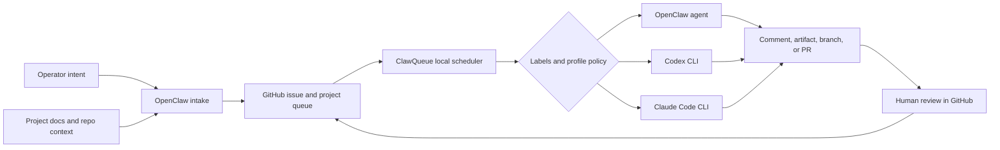
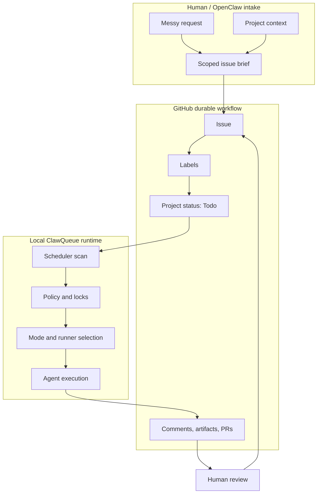

# Mermaid Diagram Improvement Previews

Issue: https://github.com/ClawQueue/ClawQueue/issues/10

Status: draft preview for human approval. No ClawQueue source files have been changed.

## Diagnosis

The current README Mermaid diagram explains the system, but it is doing too much in one vertical chain:

- intake, queueing, dispatch, runners, artifacts, and review all sit at the same visual weight
- runner options branch late, which makes the central CQ control loop less obvious
- OpenClaw appears both as intake and as one runner, but the difference is not visually explained
- the diagram is readable on desktop, but it is tall and less scannable in narrow views

The docs homepage currently uses a custom HTML flow instead of Mermaid. That is visually cleaner, but it loses some architecture clarity from the README.

## Recommendation

Approve **Variant A** as the primary replacement for the README Mermaid diagram. It keeps the strongest story:

1. OpenClaw/operator context shapes the work.
2. GitHub owns the durable queue.
3. CQ dispatches locally by policy and labels.
4. Agents/runners return reviewable output to GitHub.

Use **Variant B** only if we want a more technical architecture diagram later in the operator docs.

## Variant A - Control Loop

Best for README and public docs because it is compact and narrative-first.

Preview:




## Variant B - Three-Lane System View

Best for operator docs because it separates human/GitHub/local-runtime responsibilities.

Preview:




## Approval Choice

- **Approve A**: apply Variant A to the README and optionally reuse it in docs.
- **Approve B**: use the swimlane version for operator docs, not the homepage.
- **Request second pass**: ask CMO to create a more visual/brand-forward version that uses VitePress HTML instead of Mermaid.

## Follow-up Implementation Issue

Title: `[dev] Apply approved Mermaid diagram improvements`

Labels: `dev`, `cq:change`, `documentation`

Body:

```md
## Goal

Apply the approved Mermaid diagram from #10 to ClawQueue docs/source.

## Source artifact

Use the approved preview artifact:
https://github.com/ClawQueue/ClawQueue-reports/tree/main/boards/CORE/0010-mermaid-diagram-previews

## Task

- Replace the current README Mermaid diagram with the approved variant.
- If Manos approved reuse in docs, update `docs/index.md` or the relevant operator docs page too.
- Preserve existing positioning and links.

## Acceptance criteria

- Mermaid renders correctly on GitHub.
- Docs build passes locally.
- PR includes before/after notes and verification.
- Do not merge until Manos approves the PR.
```
